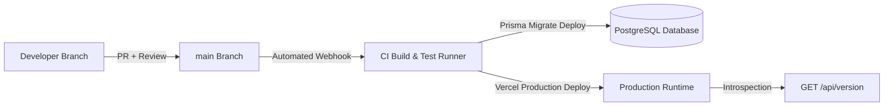

# Política e Arquitetura de Deploy Determinístico & Fonte Única de Verdade

## 1. Princípio da Fonte Única de Verdade (Single Source of Truth)
1. **Repositório Git Central**: A branch `main` do repositório GitHub (`helderlabs-erp`) constitui a **única** e irrevogável fonte de verdade para todos os ambientes de produção e homologação.
2. **Proibição Estrita de Alterações Manuais**: É terminantemente proibido qualquer tipo de upload manual de ficheiros, edição direta via interface de alojamento (ex.: painel Vercel/FTP/SSH) ou substituição ad-hoc de binários/assets.
3. **Imutabilidade de Artefactos**: Qualquer alteração em produção tem de ter origem num commit versionado no Git com hash SHA identificável.

---

## 2. Fluxo de Trabalho (Git Workflow)
- **Desenvolvimento & Correções**: Ramos de funcionalidade/correção (`feat/*`, `fix/*`) criados a partir da `main`.
- **Validação Local & Red-Green**:
  - `npm run typecheck` (0 erros TypeScript).
  - `npm test` (100% de testes verdes com asserções reais).
  - `npm run audit:verify` (Cadeia de auditoria 100% íntegra).
- **Integração**: Pull Request (PR) com revisão e aprovação. Merge na branch `main`.

---

## 3. Pipeline CI/CD Automatizado


1. **Gatilho de Deploy**: Apenas commits na branch `main` despoletam a compilação e publicação automática na Vercel.
2. **Migrações de Base de Dados**:
   - As migrações da base de dados são executadas exclusivamente através de `prisma migrate deploy`.
   - Nenhuma alteração DDL é aplicada manualmente.
   - O histórico de migrações fica registado na tabela interna `_prisma_migrations`.
3. **Variáveis de Ambiente de Compilação / Runtime**:
   - `VERCEL_GIT_COMMIT_SHA` / `GIT_COMMIT_SHA`: SHA do commit em execução.
   - `BUILD_TIME` / `VERCEL_BUILD_TIME`: Timestamp ISO-8601 da compilação.
   - `NODE_ENV` / `ENVIRONMENT`: Ambiente operacional (`production`, `staging`, `development`).

---

## 4. Introspeção em Tempo Real: Endpoint `GET /api/version`
Para garantir a auditabilidade a qualquer instante e eliminar incertezas quanto à versão em execução no cluster/servidor, a aplicação expõe o endpoint público:

```http
GET /api/version
```

### Formato de Resposta (JSON):
```json
{
  "commitSha": "a1b2c3d4e5f67890...",
  "buildTime": "2026-09-11T00:00:00.000Z",
  "environment": "production",
  "schemaVersion": "1.0.0",
  "latestMigration": "20260910000000_init_audit_chain"
}
```

### Propriedades:
- `commitSha`: Hash SHA-1 completo do commit Git que originou a build.
- `buildTime`: Timestamp da compilação da aplicação.
- `environment`: Identificador do ambiente em execução.
- `schemaVersion`: Versão semântica da aplicação/schema.
- `latestMigration`: Nome da última migração Prisma aplicada com sucesso na base de dados.
