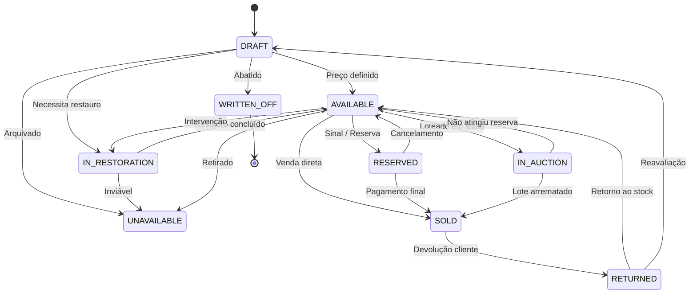

# DEFINIÇÕES CANÓNICAS — 2SELLMAIS (`sellmais`)

> **Módulo:** 2SELLMAIS (Inventário & Antiguidades) · **Chave técnica:** `sellmais`  
> **Versão:** v0.5.0 · **Fonte Única de Verdade Operacional, Matemática & Fiscal**

---

## 1. PAPÉIS & PERMISSÕES

O módulo 2SELLMAIS implementa controlo de acessos baseado em permissões por tenant:

| Papel / Permissão | Descrição | Âmbito de Acesso |
| :--- | :--- | :--- |
| `sellmais.item.read` | Visualização de fichas de artigos | Itens do catálogo interno |
| `sellmais.item.write` | Criação e edição de fichas de artigos e atributos | Criação / Edição |
| `sellmais.cost.read` | Visualização de custos confidenciais (`acquisitionCents`, `extraCostsCents`, `marginCents`, fornecedores) | Apenas Gestores e Administradores |
| `sellmais.cost.write` | Adição e remoção de custos de restauro e peritagem | Gestão de Custos |
| `sellmais.consign.manage` | Criação de acordos e liquidação a comitentes | Consignações |
| `sellmais.auction.manage` | Gestão de lotes, datas e fecho de leilões | Leilões |
| `sellmais.channel.manage` | Configuração de canais de venda e processamento da outbox | Multi-Canal |

---

## 2. REGRAS DE NEGÓCIO CANÓNICAS

### 2.1 A Regra de Ouro — Integridade Financeira dos Custos
1. **Materialização em Tempo Real:**
   $$\text{totalCostCents} = \text{acquisitionCents} + \sum \text{extraCostsCents}$$
   O campo `totalCostCents` e `extraCostsCents` são recalculados e persistidos no registo `SellItem` atomicamente em cada adição ou remoção de custo (`SellItemCost`).
2. **Cálculo da Margem Real de Lucro:**
   - **Compra Direta:**
     $$\text{realProfitCents} = \text{soldPriceCents} - \text{totalCostCents} - \text{channelFeeCents}$$
   - **Artigo Consignado:**
     $$\text{realProfitCents} = \text{shopCommissionCents} - \text{extraCostsCents}$$
3. **Regime de Margem de IVA (Bens em Segunda Mão):**
   - O campo booleano `vatMarginScheme` identifica bens abrangidos pelo Regime Especial de Tributação da Margem (Decreto-Lei n.º 199/96). O IVA é liquidado apenas sobre a margem de lucro e não sobre o total da venda.

---

### 2.2 Máquina de Estados Estrita do Artigo

- **Transições Proibidas (HTTP 409):** Nenhuma transição direta fora do grafo é permitida (ex.: `DRAFT` direto para `SOLD`, ou `SOLD` direto para `AVAILABLE` sem passagem por `RETURNED`).
- **Despublicação Automática:** Sempre que um artigo transita para `SOLD`, `RESERVED`, `IN_AUCTION` ou `UNAVAILABLE`, são criados imediatamente registos na tabela `SellChannelJob` (Outbox) com ação `UNPUBLISH` para todos os canais ativos.

---

### 2.3 Atributos Dinâmicos JSONB com Validação de Schema
Os tipos de artigo (`SellItemType`) definem dinamicamente os campos requeridos e opcionais com validação via Zod em runtime:
- **Relojoaria (`relogio`):** `marca` (text), `movimento` (enum: Automático, Manual, Quartzo), `materialCaixa` (text), `caixaOriginal` (boolean).
- **Mobiliário (`mobiliario`):** `madeira` (text), `estilo` (text), `gavetas` (integer), `restaurado` (boolean).
- **Pintura (`pintura`):** `tecnica` (text), `autor` (text), `assinado` (boolean), `comMoldura` (boolean).
- **Joalharia (`joia`):** `metal` (enum), `pesoGramas` (number), `pedrasPreciosas` (text), `contrastaria` (boolean).
- **Discos & Vinil (`vinil`):** `artista` (text), `album` (text), `anoEdicao` (integer), `estadoDisco` (enum).

---

### 2.4 Consignações & Payout de Comitentes
1. **Registo:** Contrato de consignação com referência `CSG-YYYY-NNNN`, comissão acordada (`commissionPercent` em centésimas de %, ou `commissionFixedCents`).
2. **Custo Inicial:** Artigos em consignação entram com `acquisitionCents = 0`.
3. **Liquidação:**
   $$\text{shopCommissionCents} = \text{round}\left(\frac{\text{soldPriceCents} \times \text{commissionPercent}}{10000}\right) + \text{commissionFixedCents}$$
   $$\text{consignorPayoutCents} = \text{soldPriceCents} - \text{shopCommissionCents}$$

---

### 2.5 Concorrência & Leilões
1. **Atomicidade:** Licitações processadas dentro de transação isolada com verificação do valor mínimo:
   $$\text{minAllowed} = \begin{cases} \text{startingBidCents}, & \text{se sem lances anteriores} \\ \text{currentBidCents} + \text{minIncrementCents}, & \text{se já existem lances} \end{cases}$$
2. **Regra Anti-Sniping:** Qualquer lance submetido nos últimos 2 minutos de um leilão ativo estende o término do leilão em 5 minutos adicionais para permitir contra-ofertas limpas.

---

### 2.6 Catálogo Público SSR & Whitelist de Segurança
- **Rotas Públicas:** `/loja` e `/loja/artigo/:slug`
- **Garantia de Whitelist:** O servidor renderiza HTML diretamente via SSR omitindo estritamente campos confidenciais do modelo Prisma (`acquisitionCents`, `extraCostsCents`, `minPriceCents`, `supplierCompanyId`, notas internas e custos de restauro).
- **SEO & JSON-LD:** Emissão de Schema.org `Product` e `Offer` com OpenGraph tags (`og:title`, `og:image`, `og:description`).
